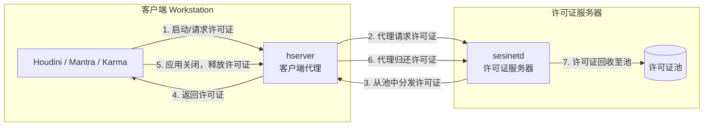

# Houdini中的hserver和sesinetd是干嘛用的
---
**sesinetd（许可证服务器）**：负责管理所有许可证的发放与回收。
**hserver（客户端代理）**：Houdini客户端通过hserver向许可证服务器申请许可证和归还许可证。

它们通过客户端-服务器模型协同工作，下面的图表清晰地展示了这一流程：

```mermaid
flowchart LR
    subgraph Client[客户端 Workstation]
        App[Houdini / Mantra / Karma]
        HServer[hserver<br>客户端代理]
    end

    subgraph Server[许可证服务器]
        SESINetD[sesinetd<br>许可证服务器]
        License[(许可证池)]
    end

    App -- 1. 启动/请求许可证 --> HServer
    HServer -- 2. 代理请求许可证 --> SESINetD
    SESINetD -- 3. 从池中分发许可证 --> HServer
    HServer -- 4. 返回许可证 --> App
    
    App -- 5. 应用关闭，释放许可证 --> HServer
    HServer -- 6. 代理归还许可证 --> SESINetD
    SESINetD -- 7. 许可证回收至池 --> License
```
