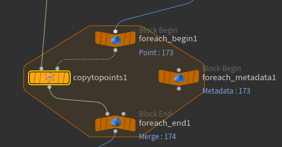

**Copy to Points** 节点将**输入1**中指定的几何体复制到**输入2**指定的几何体的点位上。

**注意**：每个几何体副本的数据都会被添加到最终的Geometry Sheet中。如果场景中有大量的几何体副本存在，可能会意味着会消耗大量的内存。此时，你可能会更需要 render-time instancing、Alembic、packed primitives、polysoups 来减少内存开销。

## 目标点位的属性

当你把几何体复制到点位上时，Houdini 会查找目标点位上的特定属性，用来定制这个点位上的副本。

#### 属性

| 属性名 | 类型 | 说明 |
| --- | --- | --- |
| `orient` | `float4`（四元数） | 副本的朝向。 |
| `pscale` | `float` | 等比缩放。 |
| `scale` | `float3` | 非等比缩放。 |
| `N` | `vector` | 法线。如果没有 `orient` 属性，则作为副本 `+Z` 轴的朝向。 |
| `up` | `vector` | 上方向向量。如果没有 `orient` 属性，则作为副本 `+Y` 轴的朝向。 |
| `v` | `vector` | 副本的速度。用于运动模糊；如果没有 `orient` 或 `N`，也会作为副本 `+Z` 轴的朝向。 |
| `rot` | `float4`（四元数）| 额外旋转，会在 `orient` 属性之后应用。|
| `P` | `vector` | 副本的位置。 |
| `trans` | `vector` | 在 `P` 的基础上额外应用的偏移。 |
| `pivot` | `vector` | 副本的局部轴心点。 |
| `transform` | `3×3` 或 `4×4` 矩阵 | 变换矩阵。它会覆盖除 `P`、`pivot` 和 `trans` 产生的平移以外的所有变换。 |
| `shop_materialpath` | `string` | 材质路径。你可以使用**材质表面**节点把这个属性添加到点位上。当对象被复制到带有这个属性的点位上时，副本对象会使用指定的材质。仅最终渲染时生效，视口中不支持该属性。 |
| `material_override` | `string` | 一个序列化后的 Python 字典，用于把参数名称映射到参数值。你可以使用**材质表面**节点中的 override 控制项，把这个属性添加到点位上。当对象被复制到带有这个属性的点位上时，副本对象会把这些覆盖值应用到它的材质上。仅最终渲染时生效，视口中不支持该属性。 |

#### 优先级

如果存在 `pivot`，则使用它作为副本的局部变换。

如果存在 `transform` 属性：

- 使用它作为 `3×3` 或 `4×4` 矩阵来变换副本。

如果不存在 `transform` 属性：

- 如果存在 `orient` 属性，使用它来确定副本的朝向。
- 如果不存在 `orient` 属性，则使用 `N` 作为 `+Z` 轴，并使用 `up` 作为 `+Y` 轴来确定副本的朝向。
- 如果不存在 `N`，但存在 `v`，则使用 `v`，也就是速度属性。
- 如果存在 `rot` 属性，则在上述朝向变换之后应用它。
- 如果存在 `pscale`，则用它缩放副本；如果同时存在 `scale`，则与 `scale` 相乘。
- 如果存在 `scale`，则用它缩放副本；如果同时存在 `pscale`，则与 `pscale` 相乘。

如果存在 `trans`，则结合 `P` 使用它来移动副本。

### 使用For-Each循环定制副本
如果你想对每个副本进行更精细的控制，可以使用For-Each循环来定制每个点位上的副本。你可以使用 detail 表达式函数来获取 foreach metadata 上循环变量中的值，或使用 point 表达式函数获取点的属性。

